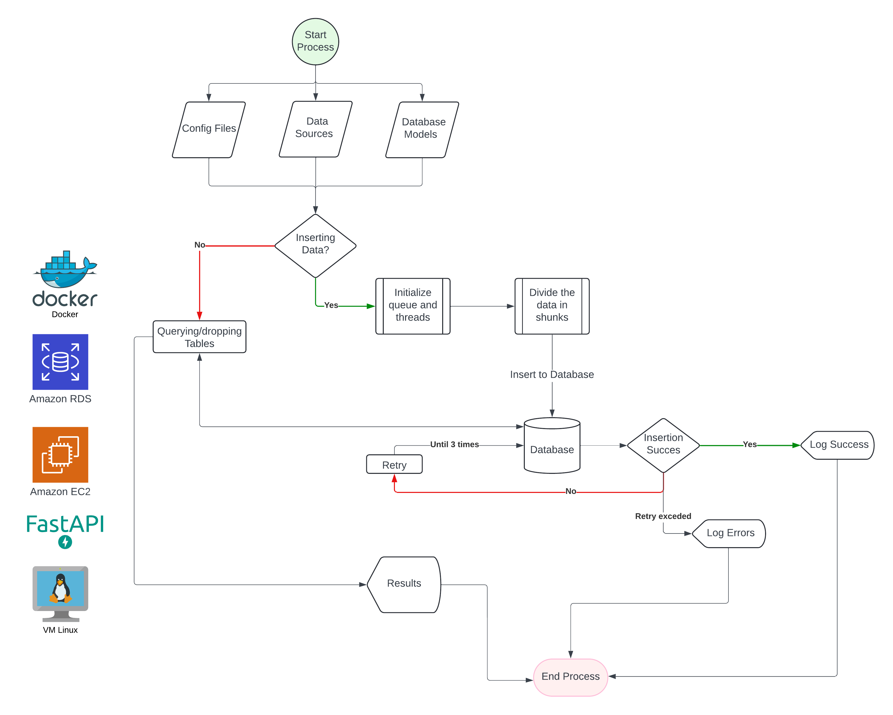

# Data Challenge Project

This repository contains the Data Challenge application, which processes and manages data for employee, job, and department entities. It features database interactions, queue management, and threading.

### The API

- The API was created using FAST API package (https://fastapi.tiangolo.com/). 
- The Database used is a MySQL database hosted in AWS RDS under the free tier.
- You can connect to the API in the following link. It is hosted in an EC2 instance: http://3.131.36.170:8000/docs

You can test the endpoints from the Swagger documentation.

Note: The database and the EC2 instances are configured to allow all traffic from the internet (both inbound and outbound rules). This setup was chosen for convenience due to time constraints. For enhanced security in the future, we can integrate authentication into the API, such as using Okta. Creating IAM roles and running everything within a controlled VPC would be advisable.

Due to time constraints, I was unable to perform tests, mock connections, or use pytest.

You can find the SQL logic that answers the SQL questions of the challenges here: https://github.com/WRopero/data_challenge_repo/blob/main/app/config/sql/

#### High level workflow of the App



### Database Structure


### Docker Image

To build the Docker image use:

```docker build -t fastapiapp .```

To expose the App: ```docker run -p 8000:8000 fastapiapp ```

The source code was taken from github. The git client was installed in the Ec2 instance.

Installing docker within the Amazon Linux Free tier instance:
- `sudo dnf update -y`
- `sudo dnf install docker -y`
- `sudo systemctl start docker`
- `sudo docker version`
- `sudo usermod -aG docker ${USER}`
- `newgrp docker`

### Explanation of the Structure

- **`app/` directory**: Contains the Python scripts that form the core of the application. It is structured into several subdirectories:
  - **`components/`**: Houses the core functionalities such as managing database operations (`database_manager.py`), handling tasks in queues (`queue_manager.py`), and managing threads for concurrent execution (`threading_manager.py`).
  - **`config/`**: Includes configuration files like `config.yaml` which could store settings for the application and SQL directories containing SQL scripts for database queries (`question_1.sql`, `question_2.sql`).
  - **`models/`**: Contains `database_models.py`, which would define the SQLAlchemy ORM models that mirror the structure of the database tables.
  - **`utils/`**: Consists of utility scripts that assist in tasks like reading configuration files (`read_yaml_file.py`), managing SQL queries (`get_sql.py`), and more sophisticated database model management (`manage_database_models.py`).
- **`source/` directory**: Stores CSV files (`departments.csv`, `hired_employees.csv`, `jobs.csv`) that provide initial data or are used for data import/export tasks.
- **`requirements.txt`**: Lists all Python packages needed to run the application, ensuring all dependencies are easily installable via `pip`.
- **`DER.png`**: A diagram visually representing the database's entity-relationship model, helpful for understanding the database schema at a glance.

This structure supports modularity in development and maintenance, easing scaling, and enhancing different functionalities independently.

### Tree of the Folder
```
── data_challenge
    ├── DER.png
    ├── LICENSE
    ├── README.md
    ├── app
    │   ├── components
    │   │   ├── database_manager.py
    │   │   ├── queue_manager.py
    │   │   └── threading_manager.py
    │   ├── config
    │   │   └── sql
    │   │       ├── question_1.sql
    │   │       └── question_2.sql
    │   ├── config.yaml
    │   ├── main.py
    │   ├── models
    │   │   ├── __init__.py
    │   │   └── database_models.py
    │   └── utils
    │       ├── __init__.py
    │       ├── get_sql.py
    │       ├── manage_database_models.py
    │       ├── manage_workers_and_queue.py
    │       └── read_yaml_file.py
    ├── requirements.txt
    └── source
        ├── departments.csv
        ├── hired_employees.csv
        └── jobs.csv
```
