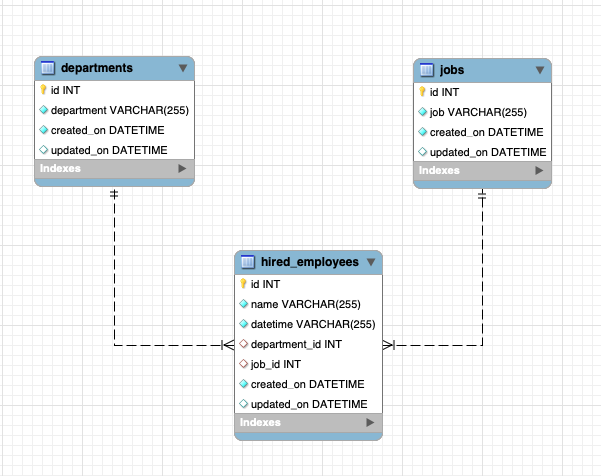

# Data Challenge Project

This repository contains the Data Challenge application, which processes and manages data for employee, job, and department entities. It features database interactions, queue management, and threading.

### The API

- The API was created using FAST API package (https://fastapi.tiangolo.com/). 
- The Database used is a MySQL database hosted in AWS RDS under the free tier.
- YOu can connect to the API in the following link from an EC2 instance: http://3.131.36.170:8000/docs

You can test the endpoinds from the swager docs.


Note: The instance of th edatabase and the EC2 isntances are allowing all the traffic from internet (outbound and inbound rules). It was easier for this challenge because of time. 
For a more secure way, in the future, We can add auth to the API like Okta. Also creating IAM roles, running everything within a controlled VPC would be better. 


### Database Structure


### Docker Image

To build th eDocker image use:

```docker build -t fastapiapp .```

To expose the App: ```docker run -p 8000:8000 fastapiapp ```


### Explanation of the Structure

- **`app/` directory**: Contains the Python scripts that form the core of the application. It is structured into several subdirectories:
  - **`components/`**: Houses the core functionalities such as managing database operations (`database_manager.py`), handling tasks in queues (`queue_manager.py`), and managing threads for concurrent execution (`threading_manager.py`).
  - **`config/`**: Includes configuration files like `config.yaml` which could store settings for the application and SQL directories containing SQL scripts for database queries (`question_1.sql`, `question_2.sql`).
  - **`models/`**: Contains `database_models.py`, which would define the SQLAlchemy ORM models that mirror the structure of the database tables.
  - **`utils/`**: Consists of utility scripts that assist in tasks like reading configuration files (`read_yaml_file.py`), managing SQL queries (`get_sql.py`), and more sophisticated database model management (`manage_database_models.py`).
- **`source/` directory**: Stores CSV files (`departments.csv`, `hired_employees.csv`, `jobs.csv`) that provide initial data or are used for data import/export tasks.
- **`requirements.txt`**: Lists all Python packages needed to run the application, ensuring all dependencies are easily installable via `pip`.
- **`DER.png`**: A diagram that visually represents the database's entity-relationship model, helpful for understanding the database schema at a glance.

This structure supports modularity in development and maintenance, easing scaling, and enhancing different functionalities independently.

### Tree of the Folder
```
── data_challenge
    ├── DER.png
    ├── LICENSE
    ├── README.md
    ├── app
    │   ├── 
    │   │   └── main.cpython-311.pyc
    │   ├── components
    │   │   ├── |
    │   │   │   ├── database_manager.cpython-311.pyc
    │   │   │   ├── queue_manager.cpython-311.pyc
    │   │   │   └── threading_manager.cpython-311.pyc
    │   │   ├── database_manager.py
    │   │   ├── queue_manager.py
    │   │   └── threading_manager.py
    │   ├── config
    │   │   └── sql
    │   │       ├── question_1.sql
    │   │       └── question_2.sql
    │   ├── config.yaml
    │   ├── main.py
    │   ├── models
    │   │   ├── __init__.py
    │   │   │   ├── __init__.cpython-311.pyc
    │   │   │   └── database_models.cpython-311.pyc
    │   │   └── database_models.py
    │   └── utils
    │       ├── __init__.py
    │       │   ├── __init__.cpython-311.pyc
    │       │   ├── get_sql.cpython-311.pyc
    │       │   ├── manage_database_models.cpython-311.pyc
    │       │   ├── manage_workers_and_queue.cpython-311.pyc
    │       │   └── read_yaml_file.cpython-311.pyc
    │       ├── get_sql.py
    │       ├── manage_database_models.py
    │       ├── manage_workers_and_queue.py
    │       └── read_yaml_file.py
    ├── requirements.txt
    └── source
        ├── departments.csv
        ├── hired_employees.csv
        └── jobs.csv
```